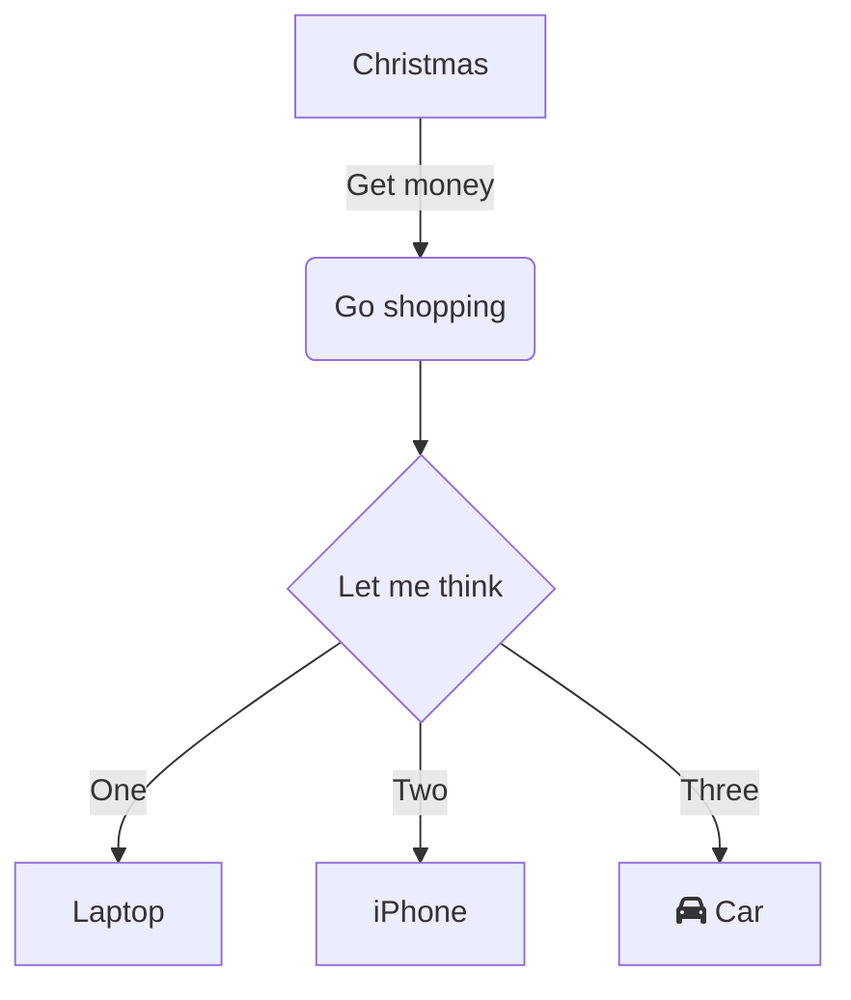

# Welcome
This is my first post

## Here is a code block
```console
sudo apt update && sudo apt upgrade -y
```

# Quick shoutout
I would like to shoutout my friend who has this great blog for documenting all of his travels.
I actually went with him on one of those trips! Can definately recommend

You can find him on [thestudenttraveller.dk](https://thestudenttraveller.dk)

# This is a mermaid block


Thanks a lot for reading

WUHU This is a great success!