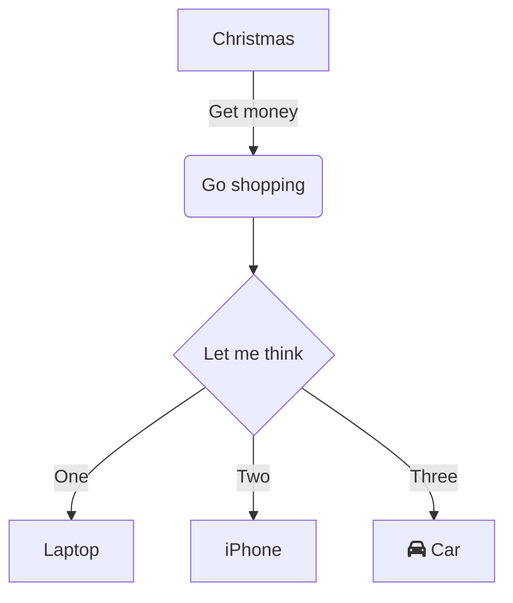

# Welcome
This is my first post

## Here is a code block
```console
sudo apt update && sudo apt upgrade -y
```

# This is a mermaid block

```mermaid
flowchart TD
    A[Christmas] --> |Get money| B(Go shopping)
    B --> C{Let me think}
    C --> |One| D[Laptop]
    C --> |Two| E[iPhone]
    C --> |Three| F[fa:fa-car Car]
```

Thanks a lot for reading

WUHU This is a great success!