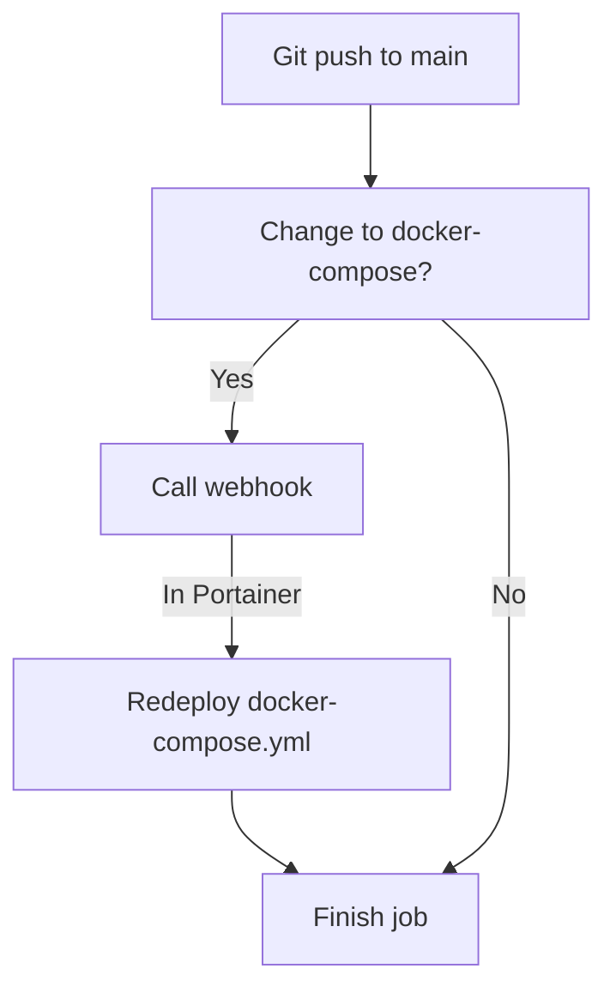

# Getting to know Github Actions for my homelab
In this project wanted to implement an automatic redeployment of my Docker Compose files whenever i change them in Github.

That sounds simple, right?

I thought so too! And it actually is.

## What you'll need
For this project to work you will need some things to be setup first.
* Docker environment with Portainer BE
* A github repository with your docker-compose files

## Creating a workflow file
For this to work you will need to create a .github/workflows folder in your repository. In that folder you need a file ending in .yml. You can do this with 'touch' in your folder.
```console
mkdir .github && cd .github
mkdir workflows && cd workflows
touch webhook-call.yml
```
I dont't care how you edit the file, but I generally use either *nano* or Visual Studio Code.
That's done with one of these commands in the directory
```console
sudo nano webhook-call.yml
```
Or to open VSCode from the directory you can write
```console
code .
```
## What do we need the action to do?
We need the action to check if there has been any changes to docker-compose.yml and, if yes, call the portainer webhook

### Part one: Begin action on push to main
For the Github Action to start itself when there is a push to the branch called 'main' we need to declare that with a few lines.
```yml
name: webhook
on:
  push:
    branches:
      - 'main'

jobs:
  Littlelink-Server:
```
This tells Github what the name of the action is and when to start it. It also declares the job and the name of the job.
### Part two: Checking for changes to docker-compose.yml
This part checks for any changes to any file in the folder called 'littlelink-server' that has the file-extension of .yml and prints the files to the output called 'docker-compose-changed.
```yml
runs-on: 'ubuntu-20.04'
    steps:
    - uses: actions/checkout@v2
    with:
        # Checkout as many commits as needed for the diff
        fetch-depth: 2
    - shell: pwsh
    # Give an id to the step, so we can reference it later
    id: check_file_changed
    run: |
        # Diff HEAD with the previous commit
        $diff = git diff --name-only HEAD^ HEAD
        # Check if a file under docs/ or with the .md extension has changed (added, modified, deleted)
        $SourceDiff = $diff | Where-Object { $_ -match '^littlelink-server/' -and $_ -match '.yml$' }
        $HasDiff = $SourceDiff.Length -gt 0
        # Set the output named "docker-compose-changed"
        Write-Host "::set-output name=docker-compose-changed::$HasDiff"
```
I have drawn a lot of inspiration from [Gérald Barré's blog post on the subject](https://www.meziantou.net/executing-github-actions-jobs-or-steps-only-when-specific-files-change.htm).
### Part three: Call the webhook if the file has changed
In this step, the action checks if the output 'docker-compose-changed' is true and then calls the webhook url. Here we have hidden the url in a secret as we did above. Change the name accordingly.
```yml
    # Run the step only if "docker-compose-changed" equals "True"
    - uses: joelwmale/webhook-action@2.3.2
      # steps.<step_id>.outputs.<output name>
      if: steps.check_file_changed.outputs.docker-compose-changed == 'True'
      with:
        url: ${LITTLELINK_PORTAINER_WEBHOOK}
      env:
        LITTLELINK_PORTAINER_WEBHOOK: ${{ secrets.LITTLELINK_PORTAINER_WEBHOOK }}
```

## Populating the yml-file
In the yml file you can copy my below configuration
```yml
name: webhook
on:
  push:
    branches:
      - 'main'

jobs:
  Littlelink-Server:
    runs-on: 'ubuntu-20.04'
    steps:
    - uses: actions/checkout@v2
      with:
        # Checkout as many commits as needed for the diff
        fetch-depth: 2
    - shell: pwsh
      # Give an id to the step, so we can reference it later
      id: check_file_changed
      run: |
        # Diff HEAD with the previous commit
        $diff = git diff --name-only HEAD^ HEAD
        # Check if a file under docs/ or with the .md extension has changed (added, modified, deleted)
        $SourceDiff = $diff | Where-Object { $_ -match '^littlelink-server/' -and $_ -match '.yml$' }
        $HasDiff = $SourceDiff.Length -gt 0
        # Set the output named "docker-compose-changed"
        Write-Host "::set-output name=docker-compose-changed::$HasDiff"

    # Run the step only if "docker-compose-changed" equals "True"
    - uses: joelwmale/webhook-action@2.3.2
      # steps.<step_id>.outputs.<output name>
      if: steps.check_file_changed.outputs.docker-compose-changed == 'True'
      with:
        url: ${LITTLELINK_PORTAINER_WEBHOOK}
      env:
        LITTLELINK_PORTAINER_WEBHOOK: ${{ secrets.LITTLELINK_PORTAINER_WEBHOOK }}
```
I have drawn a lot of inspiration from [Gérald Barré's blog post on the subject](https://www.meziantou.net/executing-github-actions-jobs-or-steps-only-when-specific-files-change.htm).
### What does this do?
